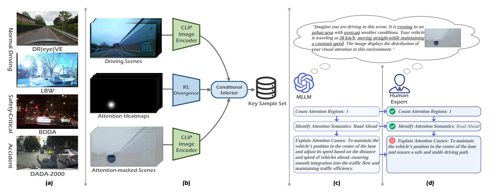

# Awesome-Open-Vision-Problem-Modeling
Practical New Tasks and Inspiring Modeling Solutions for Diverse Open Vision Problems

---
### 2025 | Paper2Poster | arXiv
**Paper2Poster: Towards Multimodal Poster Automation from Scientific Papers**  
Wei Pang, Kevin Qinghong Lin, Xiangru Jian, Xi He, Philip Torr  
[Paper](https://arxiv.org/abs/2505.21497)/[Code](https://github.com/Paper2Poster/Paper2Poster)

|  |  |
|:--------------------------------------------------:|:--------------------------------------------------:|
| **Task:** Automatic academic poster generation from long-context scientific papers. | **Modeling:**  PosterAgent, a visual-in-the-loop multi-agent pipeline with parsing, binary-tree layout planning, and iterative VLM-guided rendering refinement.|

### 2025 | DiffSensei | CVPR
**DiffSensei: Bridging Multi-Modal LLMs and Diffusion Models for Customized Manga Generation**  
Jianzong Wu, Chao Tang, Jingbo Wang, Yanhong Zeng, Xiangtai Li, Yunhai Tong  
[Paper](https://arxiv.org/abs/2412.07589)/[Code](https://github.com/jianzongwu/DiffSensei)

|  |  |
|:--------------------------------------------------:|:--------------------------------------------------:|
| **Task:** Customized manga generation with dynamic multi-character control from text. | **Modeling:**  Diffusion–MLLM hybrid framework using a text-compatible identity adapter and masked cross-attention for precise character and layout control.|

### 2025 | LLada | ICCV
**Where, What, Why: Towards Explainable Driver Attention Prediction**  
 Yuchen Zhou, Jiayu Tang, Xiaoyan Xiao, Yueyao Lin, Linkai Liu, Zipeng Guo, Hao Fei, Xiaobo Xia, Chao Gou  
[Paper](https://arxiv.org/pdf/2506.23088)/[Code](https://github.com/yuchen2199/Explainable-Driver-Attention-Prediction)

|  |  |
|:--------------------------------------------------:|:--------------------------------------------------:|
| **Task:** Explainable Driver Attention Prediction that identifies where drivers look, what they attend to, and why. | **Modeling:**  LLada, an LLM-driven framework integrating pixel-level attention, semantic parsing, and causal reasoning in an end-to-end model.|

### 2025 | DiffHDR | AAAI  
**Predicting the Original Appearance of Damaged Historical Documents**  
 Zhenhua Yang, Dezhi Peng, Yongxin Shi, Yuyi Zhang, Chongyu Liu, Lianwen Jin  
[Paper](https://arxiv.org/pdf/2412.11634)/[Code](https://github.com/yeungchenwa/HDR)

|  |  |
|:--------------------------------------------------:|:--------------------------------------------------:|
| **Task:** Historical Document Repair to reconstruct the original appearance of damaged historical texts. | **Modeling:**  Diffusion-based DiffHDR with semantic–spatial guidance and character perceptual loss for coherent restoration.|

### 2025 | Rose4D | CVPR  
**Birth and Death of a Rose**  
 Chen Geng, Yunzhi Zhang, Shangzhe Wu, Jiajun Wu  
[Paper](https://arxiv.org/abs/2412.05278)

|  |  |
|:--------------------------------------------------:|:--------------------------------------------------:|
| **Task:** Generation of temporally evolving 3D object intrinsics from pretrained 2D models. | **Modeling:**  Neural Template–guided temporal-state distillation from 2D diffusion features for consistent multi-view, multi-time rendering.|

### 2025 | GFlow | AAAI  
**GFlow: Recovering 4D World from Monocular Video**  
 Shizun Wang, Xingyi Yang, Qiuhong Shen, Zhenxiang Jiang, Xinchao Wang  
[Paper](https://arxiv.org/pdf/2405.18426)/[Code](https://github.com/littlepure2333/gflow)

|  |  |
|:--------------------------------------------------:|:--------------------------------------------------:|
| **Task:** 4D scene reconstruction from a single monocular video without camera parameters. | **Modeling:**  2D-prior-guided 4D Gaussian flow with alternating pose and dynamics optimization.|

### 2025 | VecFormer | arXiv  
**Point or Line? Using Line-based Representation for Panoptic Symbol Spotting in CAD Drawings**  
 Xingguang Wei∗, Haomin Wang∗, Shenglong Ye, Ruifeng Luo, Yanting Zhang, Lixin Gu, Jifeng Dai, Yu Qiao, Wenhai Wang, Hongjie Zhang  
[Paper](https://arxiv.org/pdf/2505.23395)

|  |  |
|:--------------------------------------------------:|:--------------------------------------------------:|
| **Task:** Computer-aided design (CAD) drawings. | **Modeling:** Type-agnostic and expressive line-based representation.|

### 2025 | SimGen | arXiv  
**SIMGEN: A DIFFUSION-BASED FRAMEWORK FOR SIMULTANEOUS SURGICAL IMAGE AND SEGMENTATION MASK GENERATION**  
 Aditya Bhat, Rupak Bose, Chinedu Innocent Nwoye, Nicolas Padoy  
[Paper](https://arxiv.org/pdf/2501.09008)

|  |  |
|:--------------------------------------------------:|:--------------------------------------------------:|
| **Task:** Simultaneous generation of surgical images and corresponding segmentation masks. | **Modeling:** Diffusion-based framework with cross-correlation priors and Canonical Fibonacci Lattice for aligned image–mask synthesis.|

### 2024 | NIGHTTIME OPTICAL FLOW | ICLR  
**EXPLORING THE COMMON APPEARANCE-BOUNDARY ADAPTATION FOR NIGHTTIME OPTICAL FLOW**  
Hanyu Zhou, Yi Chang, Haoyue Liu, Wending Yan, Yuxing Duan, Zhiwei Shi, Luxin Yan  
[Paper](https://arxiv.org/abs/2401.17642)

|  |  |
|:--------------------------------------------------:|:--------------------------------------------------:|
| **Task Definition:** Nighttime optical flow estimation. | **Modeling:** Cross-domain motion alignment. |

### 2024 | OVCoser | ECCV  
**Open-Vocabulary Camouflaged Object Segmentation**  
 Youwei Pang*, Xiaoqi Zhao*, Jiaming Zuo, Lihe Zhang, Huchuan Lu  
[Paper](https://arxiv.org/pdf/2405.19423)/[Code](https://github.com/YouweiPang/OVCOS)

|  |  |
|:---------------------------------------------:|:----------------------------------------------:|
| **Task:** open-vocabulary camouflaged object segmentation. | **Modeling:**  open-set recognition and camouflage-aware segmentation. |

### 2024 | PaSCo | CVPR  
**PaSCo: Urban 3D Panoptic Scene Completion with Uncertainty Awareness**  
Anh-Quan Cao, Angela Dai, Raoul de Charette  
[Paper](https://arxiv.org/pdf/2312.02158)/[Code](https://astra-vision.github.io/PaSCo/)

|  |  |
|:---------------------------------------------:|:----------------------------------------------:|
| **Task:** Urban 3D panoptic scene completion with instance-level understanding and uncertainty estimation. | **Modeling:**  Hybrid mask-based PSC with MIMO ensembling for voxel- and instance-wise uncertainty. |

### 2024 | PBD | CVPR  
**Towards Automatic Power Battery Detection: New Challenge, Benchmark Dataset and Baseline**  
Xiaoqi Zhao*, Youwei Pang*, Zhenyu Chen, Qian Yu, Lihe Zhang, Hanqi Liu, Jiaming Zuo, Huchuan Lu  
[Paper](https://arxiv.org/pdf/2312.02528v2)/[Code](https://github.com/Xiaoqi-Zhao-DLUT/X-ray-PBD)

|  |  |
|:---------------------------------------------:|:----------------------------------------------:|
| **Task:** Fine-grained detection of battery plates from X-ray/CT images. | **Modeling:**  Multi-dimensional collaborative framework (point, line, number). |

### 2023 | WireSegHR | CVPR  
**Automatic High Resolution Wire Segmentation and Removal**  
Mang Tik Chiu, Xuaner Zhang, Zijun Wei, Yuqian Zhou, Eli Shechtman, Connelly Barnes, Zhe Lin, Florian Kainz, Sohrab Amirghodsi, Humphrey Shi  
[Paper](https://openaccess.thecvf.com/content/CVPR2023/papers/Chiu_Automatic_High_Resolution_Wire_Segmentation_and_Removal_CVPR_2023_paper.pdf)/[Code](https://github.com/adobe-research/auto-wire-removal)

|  |  |
|:-------------------------------------------------:|:-------------------------------------------------:|
| **Task:**  Wire segmentation in high-res images. | **Modeling:**  Thin-structure semantic segmentation. |

### 2023 | TSI | arXiv  
**Traffic Sign Interpretation in Real Road Scene**  
Chuang Yang, Kai Zhuang, Mulin Chen, Haozhao Ma, Xu Han, Tao Han, Changxing Guo, Han Han, Bingxuan Zhao, Qi Wang  
[Paper](https://arxiv.org/pdf/2311.10793)

|  |  |
|:-----------------------------------------------:|:-----------------------------------------------:|
| **Task:** Traffic sign interpretation. | **Modeling:** Textual interpretation of traffic scenarios via logical reasoning. |

### 2022 | IOD | CVPR  
**Explore Spatio-temporal Aggregation for Insubstantial Object Detection: Benchmark Dataset and Baseline**  
Kailai Zhou, Yibo Wang, Tao Lv, Yunqian Li, Linsen Chen, Qiu Shen*, Xun Cao*  
[Paper](https://openaccess.thecvf.com/content/CVPR2022/papers/Zhou_Explore_Spatio-Temporal_Aggregation_for_Insubstantial_Object_Detection_Benchmark_Dataset_and_CVPR_2022_paper.pdf)/[Code](https://github.com/CalayZhou/IOD-Video)

|  |  |
|:---------------------------------------------:|:---------------------------------------------:|
| **Task:**  Insubstantial object detection. | **Modeling:** Voxel-based shift field models motion and spatial uncertainty. |

### 2022 | CCSE | arXiv  
**Instance Segmentation for Chinese Character Stroke Extraction, Datasets and Benchmarks**  
Lizhao Liu*, Kunyang Lin, Shangxin Huang, Zhongli Li, Chao Li, Yunbo Cao, and Qingyu Zhou  
[Paper](https://arxiv.org/pdf/2210.13826)/[Code](https://github.com/lizhaoliu-Lec/CCSE)

|  |  |
|:------------------------------------------------:|:------------------------------------------------:|
| **Task:**  Chinese character stroke extraction. | **Modeling:** Stroke-level instance segmentation. |
